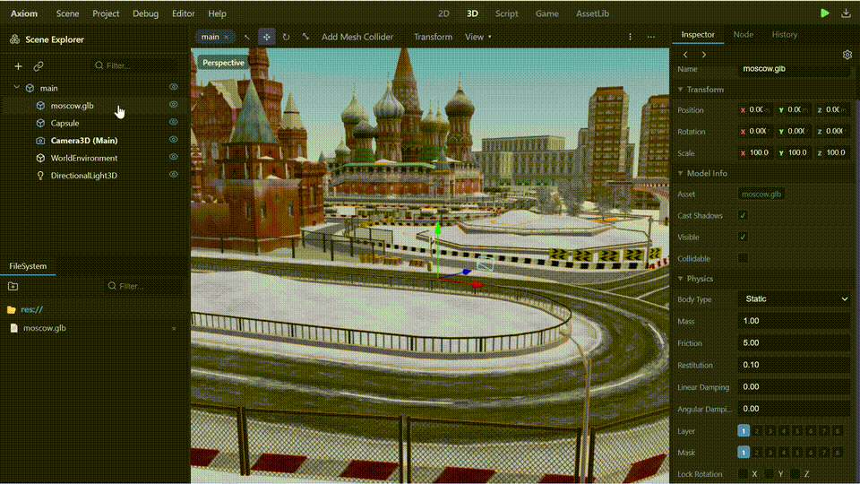
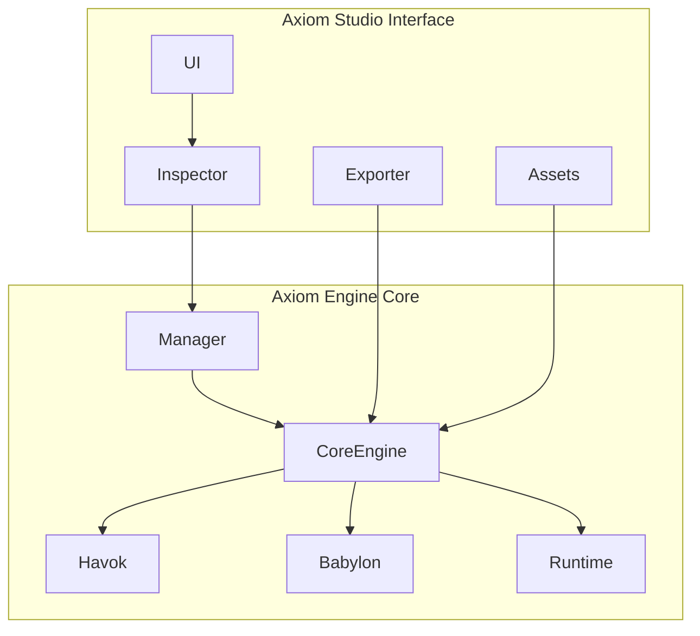

<div align="center">
  
  <p align="center">
    <strong>Axiom Game Engine — High-performance, web-native 3D. Built on Babylon.js and Havok.</strong>
  </p>
  <p align="center">
    <a href="#features">Features</a> •
    <a href="#quickstart">Quickstart</a> •
    <a href="./DOCUMENTATION.md">Documentation</a> •
    <a href="#architecture">Architecture</a>
  </p>
  <p align="center">
    
    
    
    
  </p>
</div>

---

## 🚀 The Axiom Experience

Axiom is a industrial-grade, browser-based game engine. Built from the ground up for the modern web, it delivers desktop-grade stability and one-click portability directly in your browser.

### 🍱 Flagship Features

| Feature | Description | Showcase |
| :--- | :--- | :--- |
| **Havok Battle-Tested Physics** | Native Havok UMD integration. Massive-scale collision detection, industrial stability, and real-time collider debugging. |  |
| **One-Click Mesh Collider** | Instantly generate a precise MESH collider for massive 3D models with hundreds of children. No more 'Ghost Walls'. |  |
| **Smooth Camera Follow** | Professional third-person camera system with one-click targeting and smooth interpolation. |  |
| **High-Fidelity Rendering** | Cinematic ACES tone-mapping, dynamic exponential shadows, and native PBR support for GLTF/GLB models. |  |
| **Zero-Blob Export** | Signature standalone export. Generates a single-file portable HTML with the engine and assets baked-in. |  |

---

## 🛠️ Quickstart

Experience the speed of development with Vite-driven hot-reloading.

```bash
# Clone the repository
git clone https://github.com/YourUser/AxiomEngine.git

# Install dependencies
npm install

# Start the high-performance editor
npm run dev
```

### 🖋️ Professional Scripting API
Axiom uses a familiar, event-driven API for all entity logic.

```javascript
// A simple character controller
function _ready() {
    this.speed = 10.0;
}

function _process(delta) {
    if (Input.is_action_pressed("move_forward")) {
        translate(0, 0, this.speed * delta);
    }
}
```

---

## 🏗️ Architecture

Axiom follows a modular architecture that separates the high-performance core from the development interface.



*   **Engine Core**: Uses Babylon.js for rendering and Havok for physics.
*   **Editor Layer**: A high-performance Vanilla CSS & TS shell with a Godot-style workspace.
*   **Persistence**: Uses IndexedDB for local asset management and JSON for scene serialization.

---

## 🛡️ Contributing

We follow a high-end engineering standard. If you want to contribute, please read our **[CONTRIBUTING.md](./CONTRIBUTING.md)** first. 

*   **Type Safety**: Mandatory Strict TypeScript.
*   **Visual Evidence**: All PRs must include GIF/Video evidence of changes.
*   **Performance First**: No object-allocation in hot-loops.

---

## 📜 License

Axiom Engine is released under the MIT License. Built with ❤️ by the Axiom Team.
